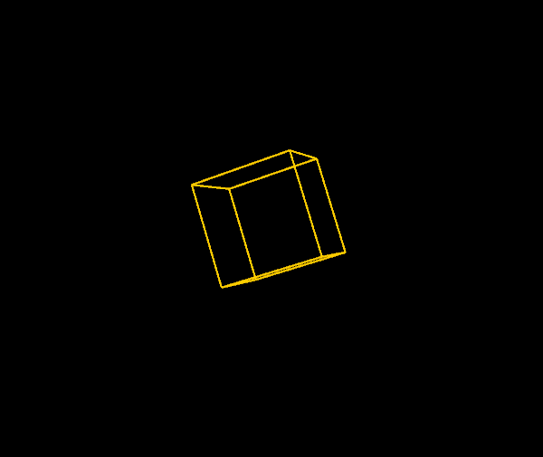
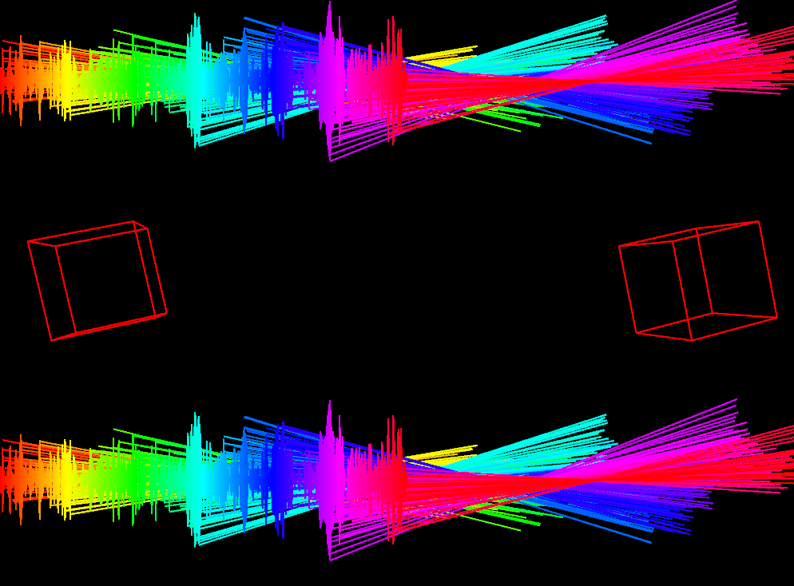
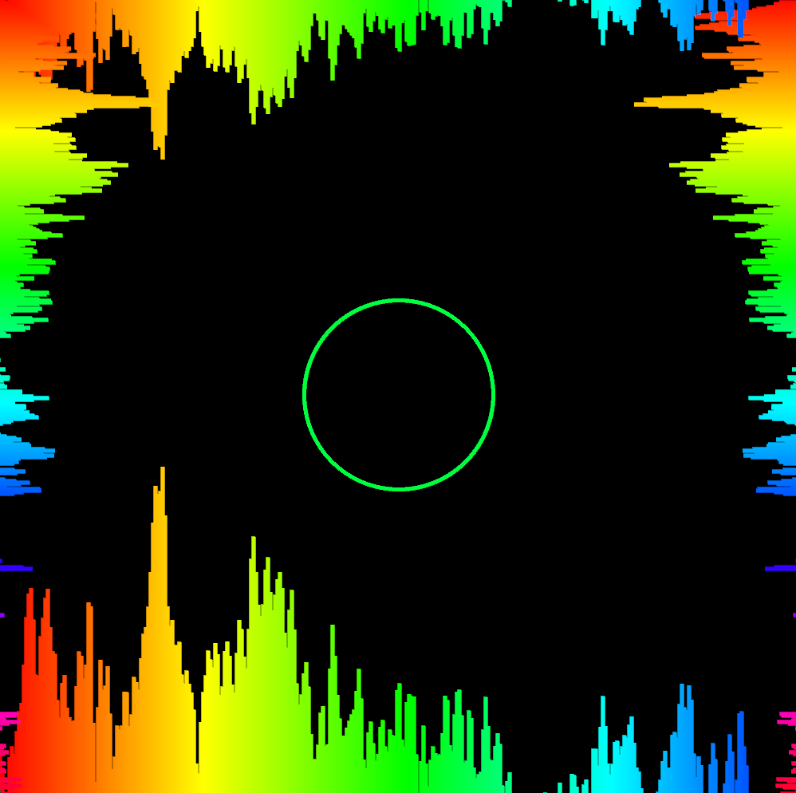
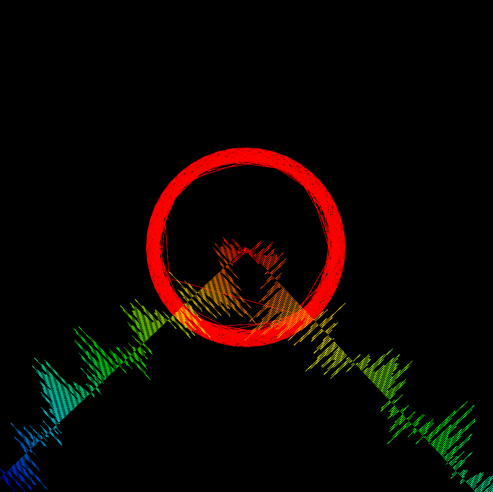
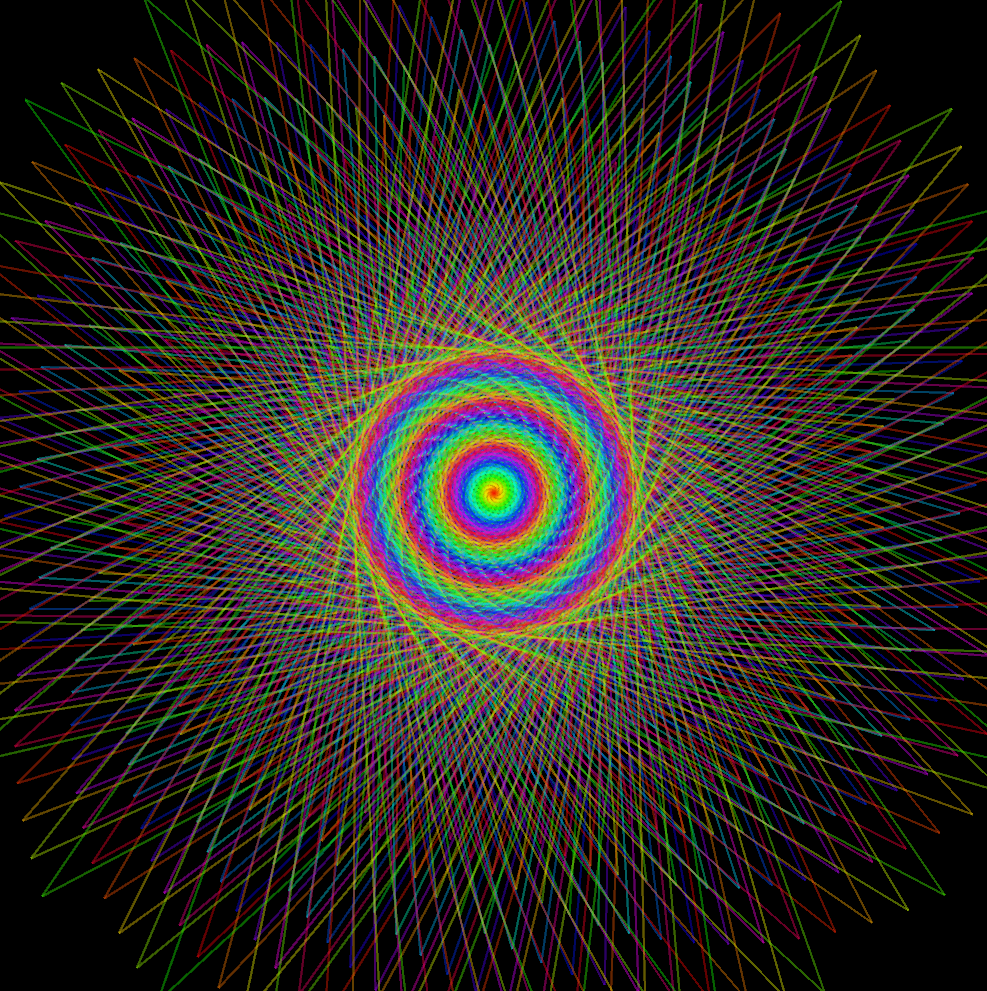

# Music Visualiser Project

Name: 
Twila Habab
Sadhbh Gowran
Nathan Flanagan

Student Number: 
C20361521
C20365601
C20482566

## Instructions
- Fork this repository and use it a starter project for your assignment
- Create a new package named your student number and put all your code in this package.
- You should start by creating a subclass of ie.tudublin.Visual
- There is an example visualiser called MyVisual in the example package
- Check out the WaveForm and AudioBandsVisual for examples of how to call the Processing functions from other classes that are not subclasses of PApplet

# Description of the assignment

Audio visualiser project where we generate animated imagery based on a piece of music.
The song we choice for our project was "Shelter" by Madeon and Porter Robinson

The groovy imagery is generated and rendered in real time and it's synchronized with the music while it's playing.

We used the changes in the music's loudness spectrum and frequency spectrum as input properties into the visualization.


Render 1



Render 2



Render 3



Render 4



Render 5



Render 6


# Instructions

When it's running you can you can use key presses to switch between the different renders.

-Key presses-

Space bar = play music

'0' = Rotating 3D Cube
'1' = Two 3D Rotating Cubes with SPECIAL waveforms :>
'2' = Bouncy ring at centre with groovy waveforms surrounding the screen
'3' = Ominous red ring with a perfectly perpendicular waveform like clock hands
'4' = What you see when you close your eyes and rub your eyes aggressively
'5' = Ominous red ring but in dotted form, was nearly a rose, but it not quite


# How it works


# What I am most proud of in the assignment
Working together

We've had our ups and downs in and out of the project, but we supported each other through it. 
We helped each other in the different renders, debugging and rubber ducking solutions to get things to work was amongst the most fun parts. 
It's the first real project where we've used git together and we got through it. 
The main thing is working together towards a collective goal and creating something groovy together and learning some skills along the way

Code wise the rose maths was very cool, liked trying out the different combinations and messing around with the addition of the wave forms too
=> Sadhbh

For what we could have done if we had the time, we had several different ideas that were sadly scrapped until the end as for personal issues amongst us, there was a huge issue with lost work and wifi connections that we had to ask for an extension for which definitely helped but still had given us a huge disadvantage in progression of our work, we had created a game of life music visualiser with different views that we sadly did not have time to implement into the main visual code, rain drops to be falling down from the screen, roses to bloom around for every beat that was hit in the music, as we have many prototypes that were even nearly finished, they regretfully were scrapped in the end of the project, in the future we want to make sure that nothing is able to hold us back and we handle our project more effectively so we can show our full potential without any accidental mishaps!
=> Nathan

As mentioned by my teammates above, provided that we had enough time, we could have reached our full potential for this project. Unfortunately we had our shortcomings and had to do this project in a rushed way. Ironically, we learned so much about ourselves (and Java processing) throughout the course of developing this project. The project had good foundation but poor groundwork. I couldn't say much more as my teammates have already said most of it, but I am for one at least proud of what we have accomplished at least in such a short time, despite the fact that we were under pressure including the exams. Considering the talent that my teammates had, for sure we could have done better if we had the good time management.
=> Twila

# Markdown Tutorial


This is a [hyperlink](http://bryanduggan.org)

# Headings
## Headings
#### Headings
##### Headings

This is code:

```Java
public void render()
{
	ui.noFill();
	ui.stroke(255);
	ui.rect(x, y, width, height);
	ui.textAlign(PApplet.CENTER, PApplet.CENTER);
	ui.text(text, x + width * 0.5f, y + height * 0.5f);
}
```

So is this without specifying the language:

```
public void render()
{
	ui.noFill();
	ui.stroke(255);
	ui.rect(x, y, width, height);
	ui.textAlign(PApplet.CENTER, PApplet.CENTER);
	ui.text(text, x + width * 0.5f, y + height * 0.5f);
}
```

This is an image using a relative URL:


This is an image using an absolute URL:


This is a youtube video:

[](https://www.youtube.com/watch?v=J2kHSSFA4NU)

This is a table:

| Heading 1 | Heading 2 |
|-----------|-----------|
|Some stuff | Some more stuff in this column |
|Some stuff | Some more stuff in this column |
|Some stuff | Some more stuff in this column |
|Some stuff | Some more stuff in this column |

